```{=html}
<style>
/* Remove bordas e alinha tudo à esquerda */
table {
  border: none !important;
  border-collapse: collapse !important;
  margin-left: 0 !important;
  margin-right: auto !important;
  width: auto !important; /* Impede que a tabela se estique */
}

td {
  border: none !important;
  vertical-align: top !important;
  padding: 0 15px 10px 0 !important; /* Espaço fixo de 15px à direita da foto */
}

/* Força a coluna da foto a ter um tamanho fixo */
td:first-child {
  width: 160px !important; 
}
</style>
```

## Orientador

::: {layout-ncol="1"}
|  |  |
|:-----------------------------:|:----------------------------------------|
| {width="120px"} | **Dr. Jorge Teodoro de Sousa** <br> *Líder do Grupo* <br> Doutor em Fitopatologia. <br> *Descrição:* Especialista em patologia florestal e manejo de doenças. <br> [Lattes](http://lattes.cnpq.br/0203148511472345) \| [ORCID](https://orcid.org) |
:::

## Pesquisadores

::: {layout-ncol="1"}
|  |  |
|:-----------------------------:|:----------------------------------------|
| 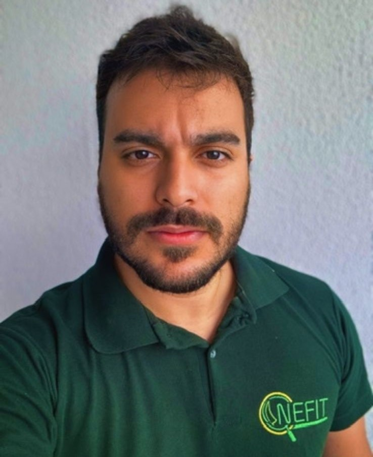{width="120px"} | **Dr. José Manoel Ferreira de Lima Cruz** <br> *Pós-Doutorando* <br> Foco em genética de populações e fungos. <br> [Lattes](http://lattes.cnpq.br/5452036626116089) |

|  |  |
|:-----------------------------:|:----------------------------------------|
| {width="120px"} | **Dra. Otília Ricardo de Farias** <br> *Pós-Doutoranda* <br> Atua em resistência de plantas a doenças. <br> [Lattes](http://lattes.cnpq.br/3912943711701774) |

|  |  |
|:-----------------------------:|:----------------------------------------|
| 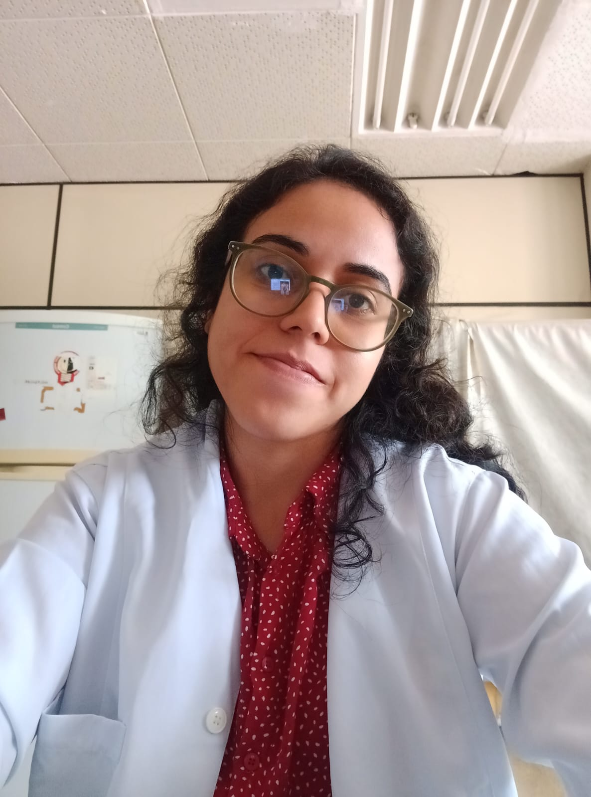{width="120px"} | **Dra. Ingrid Gomes Duarte** <br> *Pós-Doutoranda* <br> Pesquisa em controle biológico de doenças. <br> [Lattes](http://lattes.cnpq.br/0732409833061011) |
:::

## Doutorandos

::: {layout-ncol="1"}
|  |  |
|:-----------------------------:|:----------------------------------------|
| {width="120px"} | **Dr. Amir Zolfaghary** <br> *Doutorando* <br> Projeto: Bioinformática aplicada. <br> [Lattes](http://cnpq.br) |

|  |  |
|:-----------------------------:|:----------------------------------------|
| 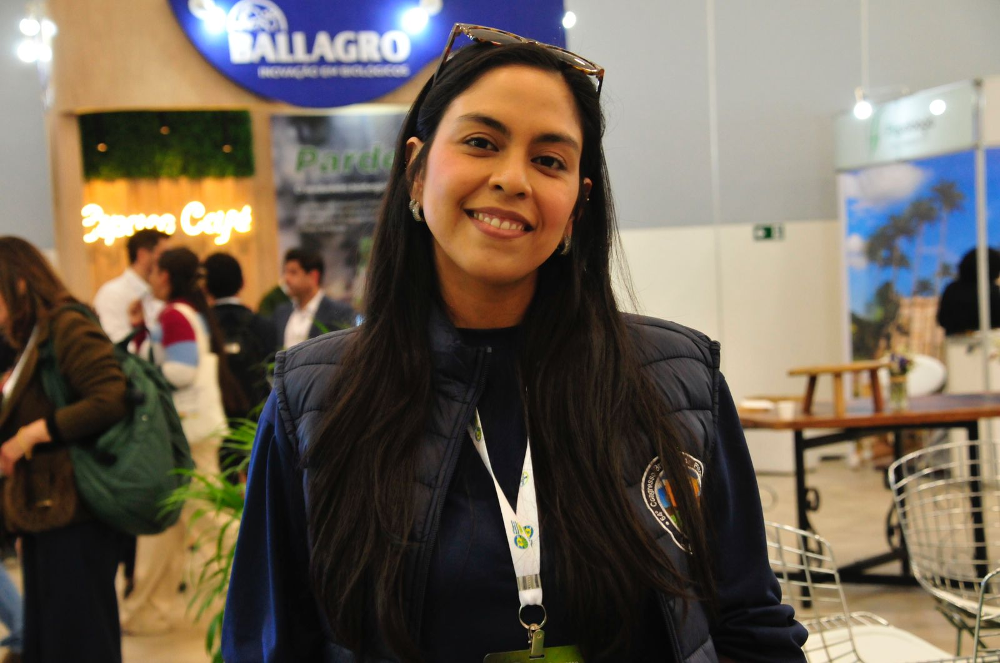{width="120px"} | **Me. Ananda dos Santos Vieira** <br> *Doutoranda* <br> Projeto: Taxonomia e filogenia. <br> [Lattes](http://lattes.cnpq.br/7183779928476044) |

|  |  |
|:-----------------------------:|:----------------------------------------|
| {width="120px"} | **Me. Brunno Cassiano Lemos Araújo** <br> *Doutorando* <br> Projeto: Epidemiologia de doenças. <br> [Lattes](http://lattes.cnpq.br/9020660874576345) |

|  |  |
|:-----------------------------:|:----------------------------------------|
| 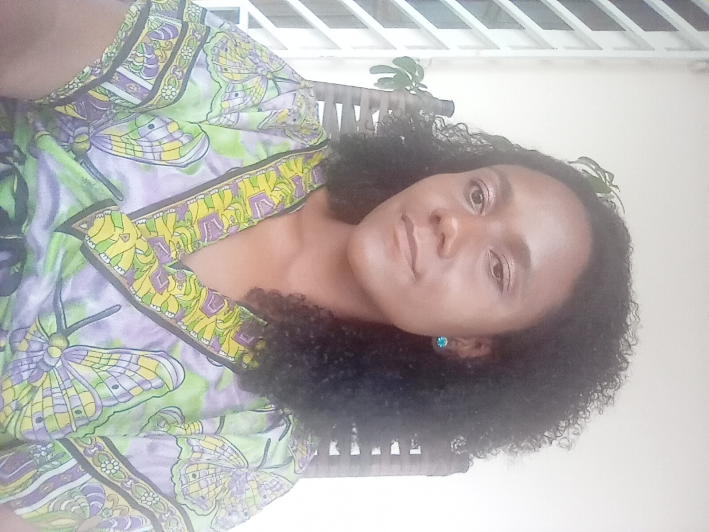{width="120px"} | **Me. Luana Nascimento da Silva** <br> *Doutoranda* <br> Projeto: Epidemiologia de doenças. <br> [Lattes](http://lattes.cnpq.br/4702932543049309) |

|  |  |
|:-----------------------------:|:----------------------------------------|
| 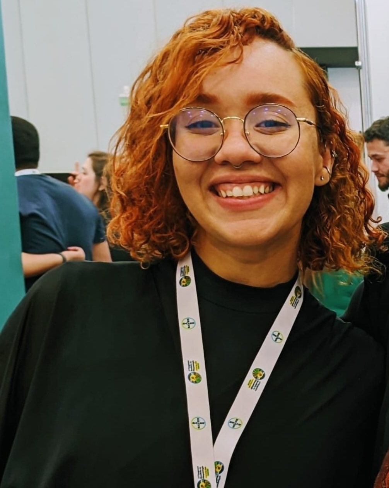{width="120px"} | **Me. Nathalyna Lúcia Moreira Souza** <br> *Doutoranda* <br> Projeto: Fitopatologia molecular. <br> [Lattes](http://lattes.cnpq.br/6510577046232121) |
:::

## Mestrandos

::: {layout-ncol="1"}
|  |  |
|:-----------------------------:|:----------------------------------------|
| 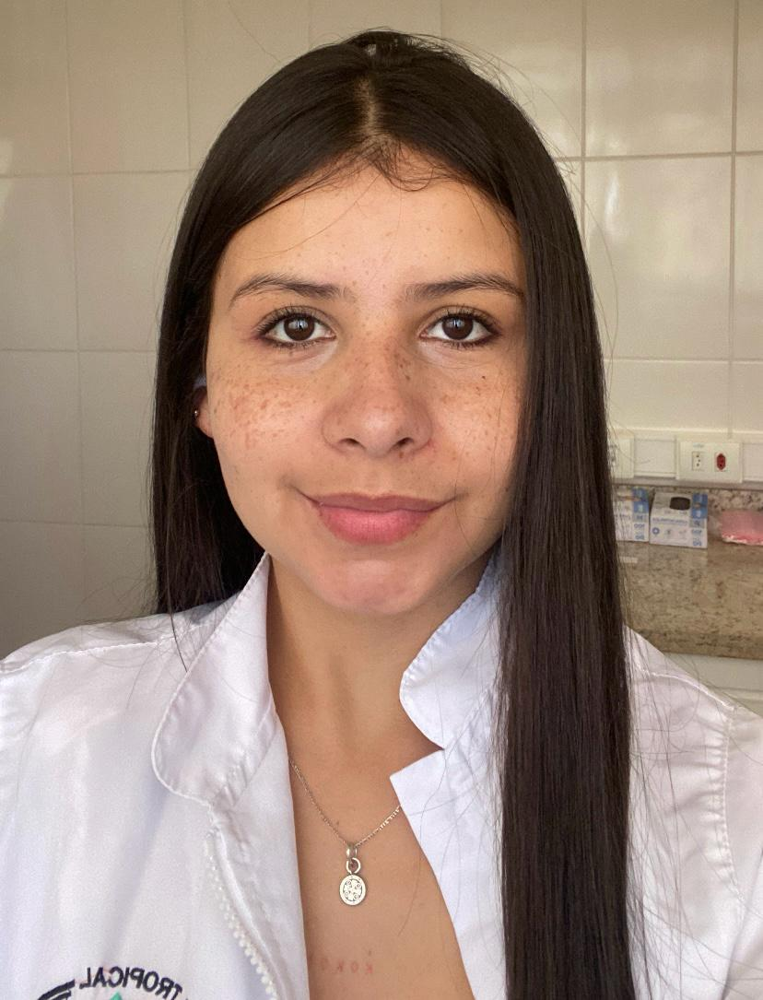{width="120px"} | **Alejandra Valencia Rivera** <br> *Mestranda* <br> Projeto: Análise de dados fitopatológicos. <br> [Lattes](http://lattes.cnpq.br/5075979752926809) |
:::

::: {layout-ncol="1"}
|  |  |
|:-----------------------------:|:----------------------------------------|
| 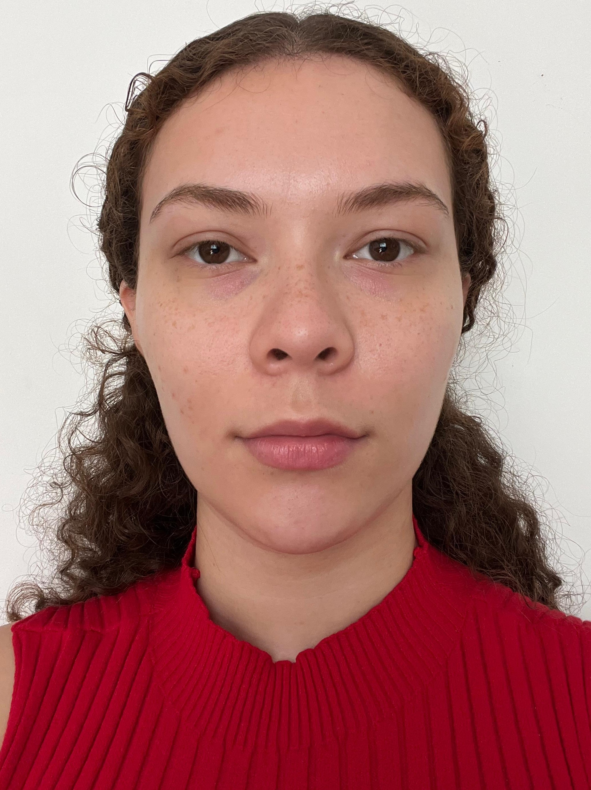{width="120px"} | **Giovanna Silveira Marques** <br> *Mestranda* <br> Projeto: Análise de dados fitopatológicos. <br> [Lattes](http://lattes.cnpq.br/2274558392560161) |
:::

## Estagiários

::: {layout-ncol="1"}
|  |  |
|:-----------------------------:|:----------------------------------------|
| {width="120px"} | **Alícia Maciel Rezende** <br> *Estagiária* <br> Projeto: Análise de dados fitopatológicos. <br> [Lattes](http://lattes.cnpq.br/4187486387735531) |
:::

::: {layout-ncol="1"}
|  |  |
|:-----------------------------:|:----------------------------------------|
| {width="120px"} | **Júlia Ferreira Campos Lopes** <br> *Estagiária* <br> Projeto: Análise de dados fitopatológicos. <br> [Lattes](http://lattes.cnpq.br/3305499644316012) |
:::

::: {layout-ncol="1"}
|  |  |
|:-----------------------------:|:----------------------------------------|
| {width="120px"} | **Laura Simões Silva de Sales** <br> *Ex-Bolsista* <br> Projeto: Análise de dados fitopatológicos. <br> [Lattes](http://lattes.cnpq.br/3901482259711554) |
:::

::: {layout-ncol="1"}
|  |  |
|:-----------------------------:|:----------------------------------------|
| 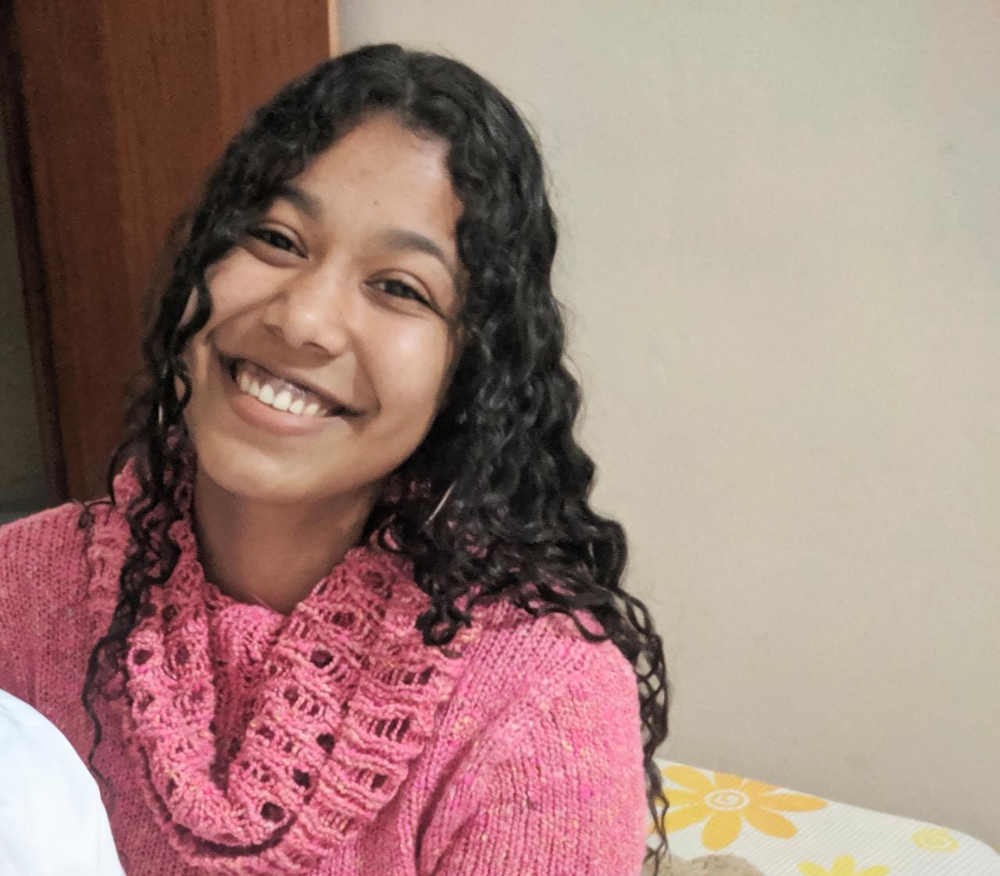{width="120px"} | **Lorena Eduarda Ribeiro Silva** <br> *Estagiária* <br> Projeto: Análise de dados fitopatológicos. <br> [Lattes](http://lattes.cnpq.br/0630523200556023) |
:::

::: {layout-ncol="1"}
|  |  |
|:-----------------------------:|:----------------------------------------|
| 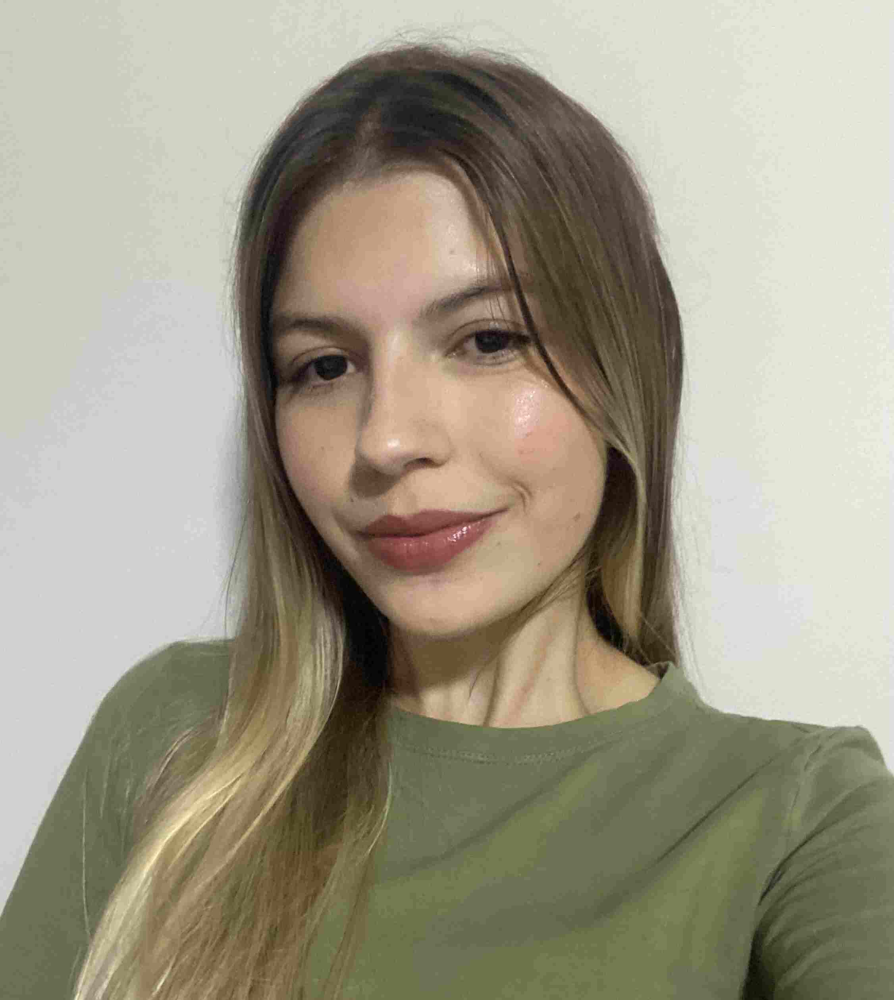{width="120px"} | **Ludmilla Pereira Diniz Rezende** <br> *Bolsista* <br> Projeto: Análise de dados fitopatológicos. <br> [Lattes](http://lattes.cnpq.br/1580428395124886) |
:::

::: {layout-ncol="1"}
|  |  |
|:-----------------------------:|:----------------------------------------|
| 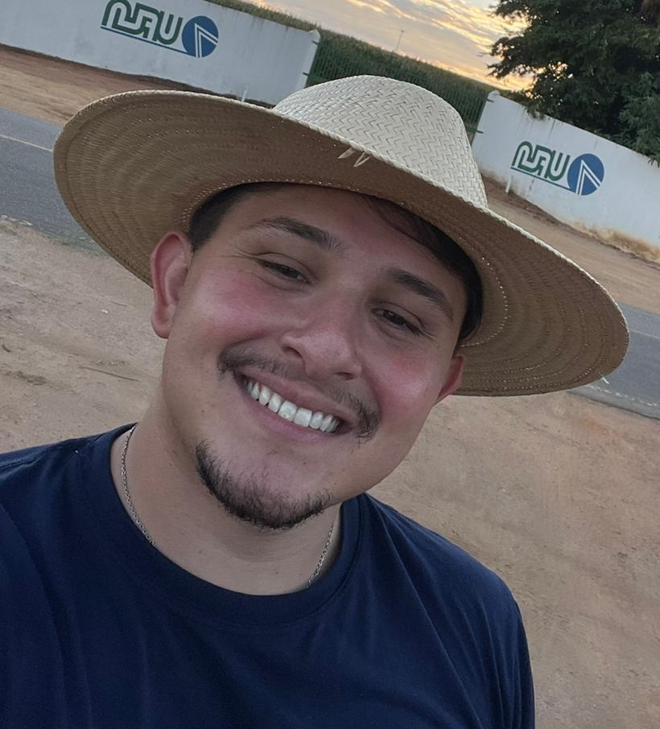{width="120px"} | **Pedro Arthur de Sousa Morgado Garcia** <br> *Ex-Bolsista* <br> Projeto: Análise de dados fitopatológicos. <br> [Lattes](http://lattes.cnpq.br/7271608729119987) |
:::

## Técnicos Administrativos

::: {layout-ncol="1"}
|  |  |
|:-----------------------------:|:----------------------------------------|
| 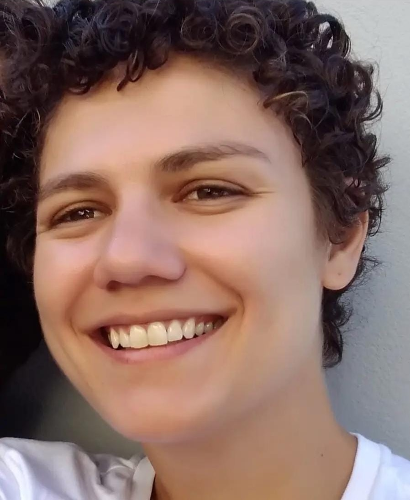{width="120px"} | **Luísa Oliveira Reis** <br> *Assistente Laboratorial* <br> Projeto: Análise de dados fitopatológicos. <br> [Lattes](http://lattes.cnpq.br/1121146188041813) |
:::
