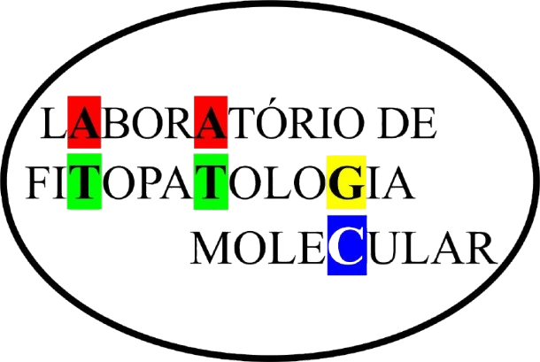

::: {layout-ncol="1" style="text-align: center;"}
{width="300px"}
:::

------------------------------------------------------------------------

### Sobre

::: {style="text-align: justify; font-size: 1.1em; margin-bottom: 1em;"}
     O **Laboratório de Fitopatologia Molecular** dedica-se à pesquisa de excelência em fitopatologia, focando especialmente em:

      **1. Diversidade de microrganismos benéficos e fitopatogênicos**

      **2. Interações planta-patógeno e com microrganismos benéficos**

      **3. Controle biológico de patógenos de plantas**

     Aqui no nosso site, você pode conhecer nossa [equipe](equipe.qmd), explorar nossas [publicações](publicacoes.qmd) mais recentes e conferir nossos [resinário](resinario.qmd).
:::
------------------------------------------------------------------------

### Nossos Objetivos
::: {style="text-align: justify; font-size: 1.1em; line-height: 2.6 !important;"}
-   Desenvolvimento de novas tecnologias para o campo.
-   Formação de pesquisadores de alto nível.
-   Colaboração científica internacional.
:::
------------------------------------------------------------------------

### Apoio e Colaboração

::: {layout-ncol="4" layout-valign="center"}
{width="120px"}

{width="120px"}

{width="120px"}

{width="120px"}
:::

------------------------------------------------------------------------
